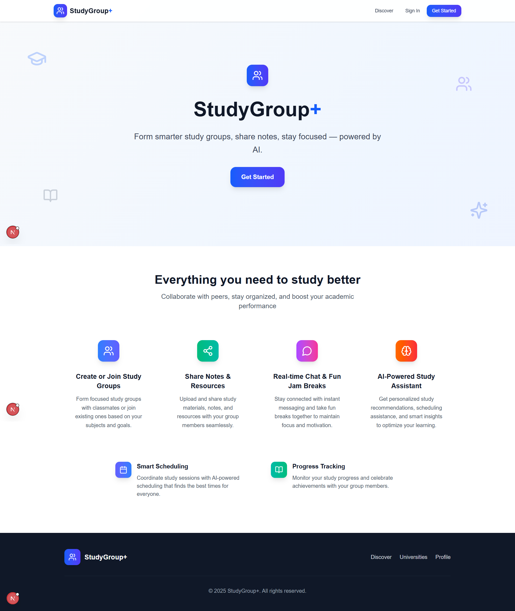
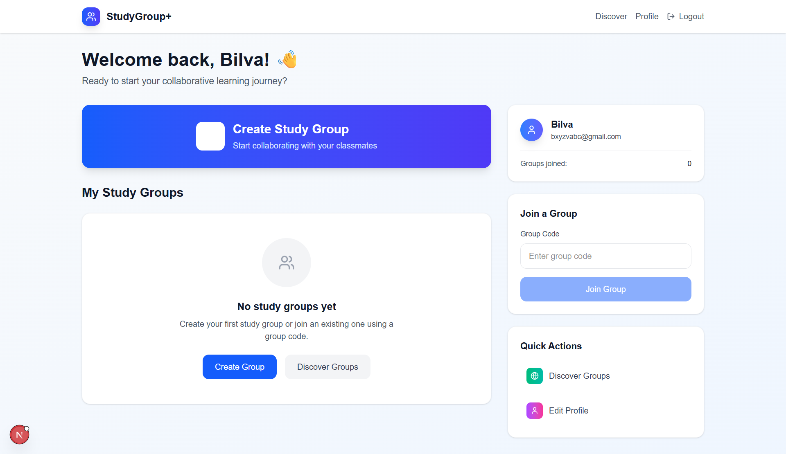
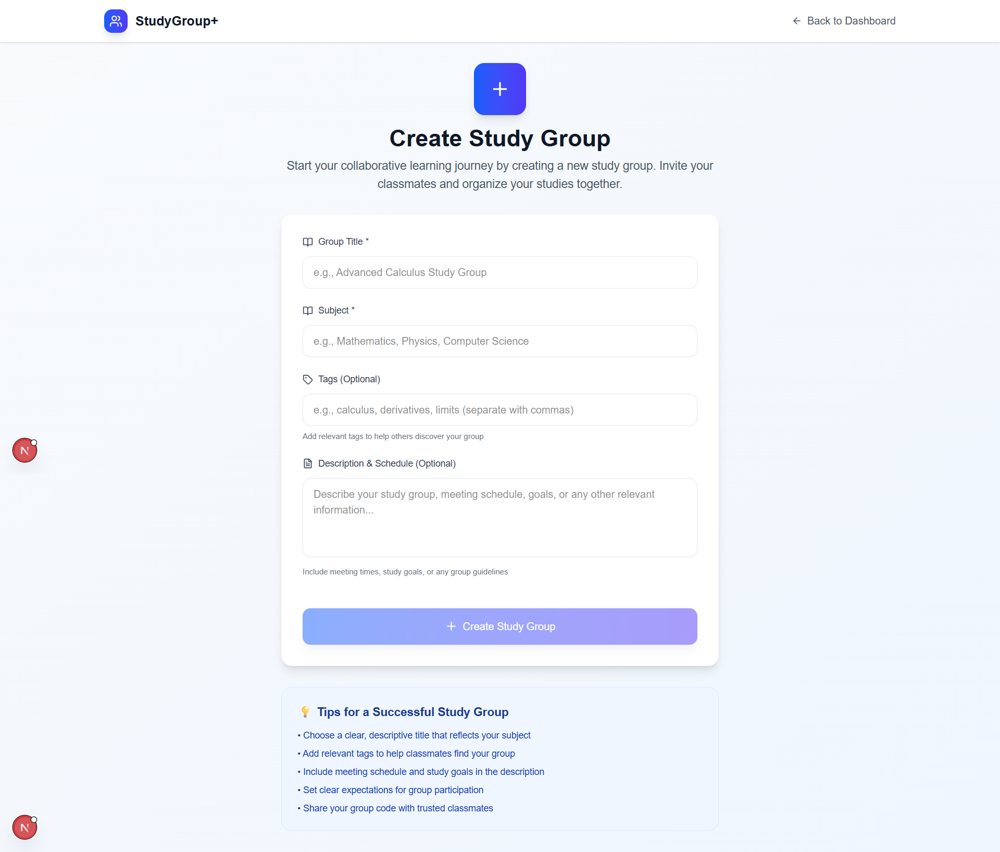
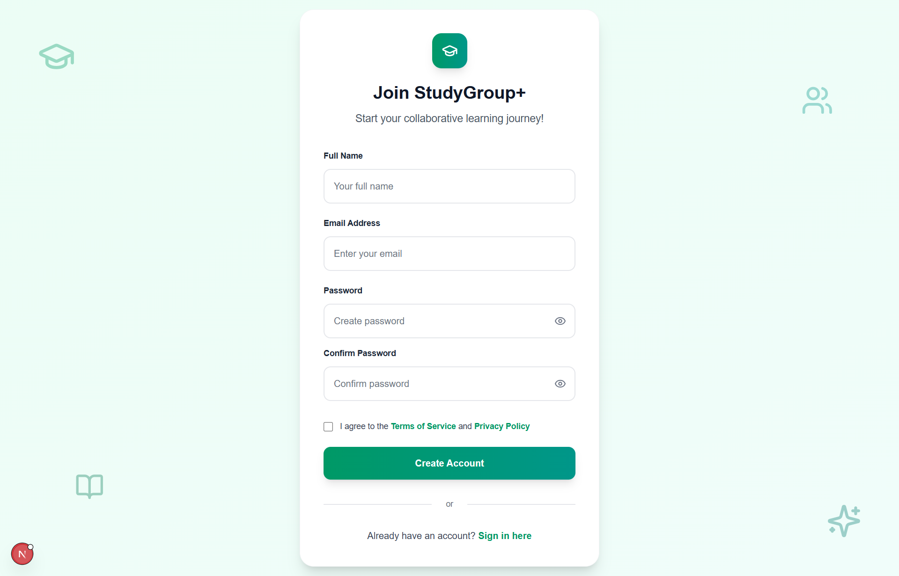
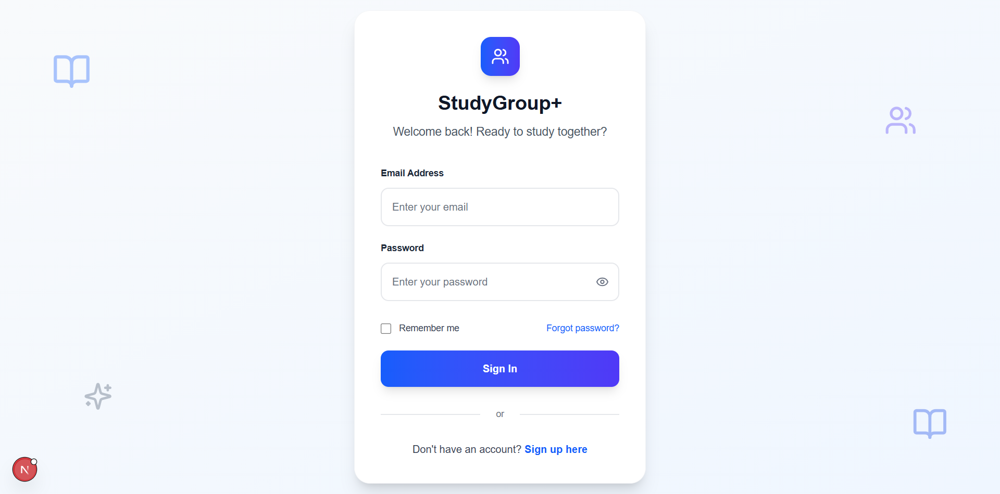
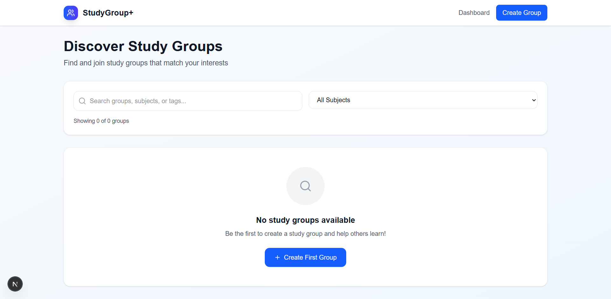

# 📚 Study Group Connector

> *“Connecting minds, one study group at a time.”*

**Study Group Connector** is a full-stack web application designed to bring learners together. It allows users to sign up, log in, create or join study groups, and collaborate with like-minded individuals. Built with React, Next.js, and MongoDB for a smooth, modern experience.

---

## 🌐 Live Demo

[🔗 Click here to see it live](https://your-deployed-link.com)  
*(Replace with your actual deployed link)*

---

## 📌 Table of Contents

- [Features](#-features)
- [Tech Stack](#-tech-stack)
- [Screenshots](#-screenshots)
- [Usage](#-usage)
- [Folder Structure](#-folder-structure)
- [Contributing](#-contributing)

---

## ✨ Features

- 🔑 User authentication (Sign Up / Login)
- 🏠 Landing page with app intro
- 📋 Dashboard after login
  - 👤 View & edit profile
  - ➕ Create a new study group
  - 🔍 Discover and join existing study groups
- 🔁 Realtime group updates
- 🔐 Protected routes and session handling
- 🎨 Clean, responsive UI

---

## 🧰 Tech Stack

**Frontend:**  
- React.js (with Next.js framework)  

**Backend & Database:**  
- Node.js & Express (API routes via Next.js)
- MongoDB with Mongoose

**Other Tools:**  
- NextAuth.js (authentication)
- GitHub (version control)

---

## 📸 Screenshots

| Landing Page | Dashboard | Create/Join Group |
|--------------|-----------|-------------------|
|  |  |  |

| Sign In Page | Login | Discover Group |
|--------------|-------|----------------|
|  |  | 
---
## 🚀 Usage

Once the project is set up and running locally:

1. Visit `http://localhost:3000` in your browser.
2. From the **Landing Page**, navigate to:
   - 🔐 **Sign Up/Login** to create your account
3. After login, access your **Dashboard**:
   - 👤 View or update your profile
   - ➕ Create a new study group with topic & description
   - 🔍 Discover available groups and **Join** any you like
4. All your joined groups will be listed in your dashboard for easy access.

This app enables seamless group-based learning and discovery among students and professionals.

---

## 📁 Folder Structure

| Path | Description |
|------|-------------|
| `studygroup-plus/` | Root of the project |
| ├── `public/` | Public assets |
| ├── `├── images/` | Static images |
| ├── `└── icons/` | Icons and SVGs |
| `├── src/` | Main source code |
| ├── `├── app/` | Next.js App Router structure |
| ├── `│   ├── (auth)/` | Auth-related pages |
| ├── `│   │   ├── login/page.tsx` | Login page  |
| ├── `│   │   └── signup/page.tsx` | Signup page  |
| ├── `│   ├── dashboard/page.tsx` | User dashboard after login |
| ├── `│   ├── create/page.tsx` | Create a new study group |
| ├── `│   ├── group/[id]/` | Dynamic route for individual groups |
| ├── `│   │   ├── page.tsx` | Group main page |
| ├── `│   │   ├── notes/` | Group notes section |
| ├── `│   │   ├── chat/` | Group chat feature |
| ├── `│   │   └── jam/` | Group jam/collaboration area |
| ├── `│   ├── discover/page.tsx` | Discover groups to join |
| ├── `│   ├── profile/page.tsx` | User profile page |
| ├── `│   ├── api/` | API routes |
| ├── `│   │   ├── auth/login/route.ts` | API - Login handler |
| ├── `│   │   ├── auth/signup/route.ts` | API - Signup handler |
| ├── `│   │   └── groups/` | (Planned) Group CRUD routes |
| ├── `│   ├── globals.css` | Global CSS styles |
| ├── `│   ├── layout.tsx` | App layout wrapper |
| ├── `│   └── page.tsx` | Landing page |
| ├── `├── components/` | Reusable UI components |
| ├── `│   ├── ui/` | Common UI elements (buttons, modals, etc.) |
| ├── `│   ├── auth/` | Auth forms and elements |
| ├── `│   ├── dashboard/` | Dashboard widgets |
| ├── `│   ├── group/` | Group-specific components |
| ├── `│   └── common/` | Navbar, Footer, etc. |
| ├── `├── lib/` | Utility and service logic |
| ├── `│   ├── mongodb.ts` | MongoDB connection setup |
| ├── `│   ├── auth-mongo.ts` | MongoDB auth helpers |
| ├── `│   └── utils.ts` | Utility functions |
| ├── `└── types/index.ts` | TypeScript interfaces and types |
| `├── .env.local` | Environment variables (Mongo URI, secrets, etc.) |
| `├── package.json` | Project dependencies and metadata |
| `└── README.md` | Project documentation |

## 🤝 Contributing

The Study Group Connector is a centralized platform designed to foster collaboration in educational environments by enabling students to form, join, and manage study groups effectively. This project contributes meaningfully to multiple stakeholders across the educational and tech ecosystems:

🧑‍🎓 1. Students (Primary Users)
The platform is built with students at its core, offering:

Better Collaboration – Connects peers studying the same subjects.

Peer Learning – Encourages mutual academic support and knowledge sharing.

Time Management – Simplifies the scheduling of study sessions.

Social Interaction – Reduces isolation, especially in remote/hybrid setups.

🏫 2. Educational Institutions
Institutions benefit from:

Improved Student Engagement – Promotes active participation and self-initiative.

Performance Tracking (if integrated) – Enables faculty to monitor group interactions.

Reduced Academic Gaps – Assists weaker students through group learning.

👩‍🏫 3. Faculty and Mentors
While optionally involved, educators gain:

Insight into Learning Trends – Observe group topics and engagement.

Group-Level Feedback – Facilitate discussions or monitor group outcomes.

Behavioral & Learning Patterns – Understand how students collaborate.

👨‍💻 4. Developers and Contributors
On the GitHub side, the project contributes to:

Open Source Community – Sharing reusable code and clean architecture.

Collaborative Development – Encouraging student coders to learn Git, GitHub, React, TypeScript, and MongoDB in real-world settings.

Portfolio Building – Contributors gain hands-on experience and public recognition for their work.

📚 5. Academic Outcomes
The Study Group Connector enhances learning outcomes by:

Increasing Retention & Motivation – Group environments keep learners engaged.

Improving Exam Readiness – Group study helps reinforce core concepts.

Encouraging Collaborative Thinking – Develops skills essential for both academics and the workforce.

🧠 6. Technical Ecosystem
Technically, the project contributes to:

Education + Technology Integration – Demonstrates how modern stacks solve real-world academic problems.

Modular, Scalable Design – Acts as a model for future ed-tech projects.

Community Innovation – Opens possibilities for features like gamification, AI-based suggestions, and more.

---

## 🌟 Final Thoughts

The Study Group Connector is more than just a platform — it’s a collaborative effort to reshape how students learn and connect. By combining educational purpose with open-source development, it bridges the gap between technology and academic growth.

Whether you're a student looking to contribute ideas, a developer eager to build real-world skills, or an educator exploring new engagement tools — there's a place for you here.

**We welcome contributions, feedback, and fresh perspectives. Let's build better learning experiences together. 🤝**

